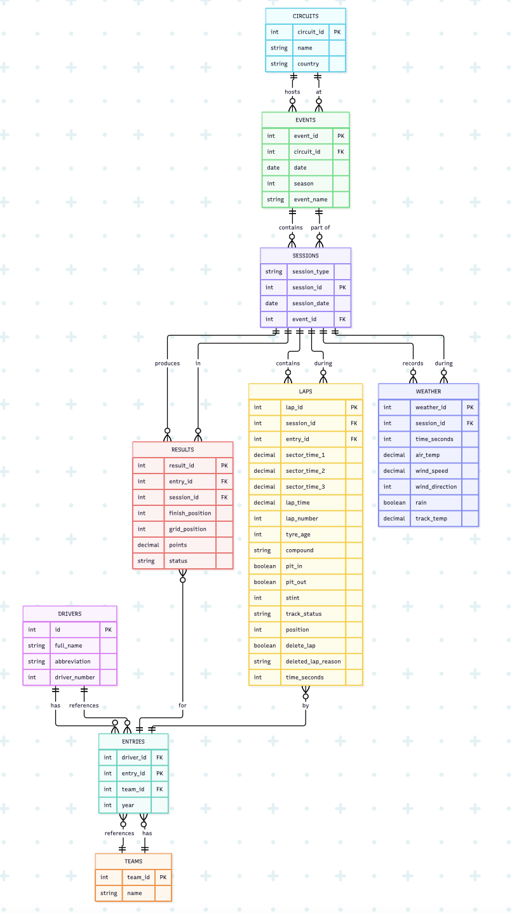

# Formula 1 Race Data Analysis Database

## Scope

### What is the purpose of your database?

The purpose of this database is to capture relationships that the FastF1 API doesn't model explicitly, such as which team a driver raced for in a given season (drivers do change teams between, and even within, seasons), and to streamline the filtering and joining otherwise required to answer a question like comparing tyre degradation across circuits.

### Which people, places, things, etc. are you including in the scope of your database?

- **Sessions**: season, event, circuit, session type (race, qualifying, sprint)
- **Results**: driver, team, grid position, finishing position, points, status
- **Laps**: lap number, lap time, sector times, compound, tyre age, stint number, pit in/out, track status, position, deleted lap / deleted lap reason
- **Weather**: air temperature, track temperature, rainfall, wind speed, wind direction, sampled per session

### Which people, places, things, etc. are outside of the scope of your database?

- **Car telemetry** (speed, throttle, brake, GPS) — not needed for the target queries.
- **Race control messages** — the raw message log and its text content are out of scope; only the structured flags FastF1 derives from it (lap deletions and corrected stint data) are included.
- **Practice sessions** — too broad a data scope for this project.

## Functional Requirements

### What should a user be able to do with your database?

**SELECT**
- Tyre degradation: How does tyre age affect a driver's lap time, and does this differ between tyre compounds?
- Weather and degradation: How do track temperature and rainfall affect tyre degradation and compound choice across circuits?
- Strategy and finishing position: Which tyre strategies are associated with the best finishing positions at different circuits?
- Positions gained/lost: How many positions did each driver gain or lose during a race?
- Teammate comparison: How does a driver's race pace compare with their teammate when using the same tyre compound?
- Rain, wind, and strategy: How do rainfall and wind conditions during a session relate to the tyre strategies teams chose, and how did that affect finishing position?
- Sector time comparison: Which sector shows the largest time gap between tyre compounds, and does that gap grow as tyres age?

**INSERT**
- Add a new race session, including its circuit, session type, weather conditions, and participating drivers' results.

**UPDATE**
- Update a driver's race result when finishing position, points, or status changes after the fact (e.g., a post-race penalty).

**DELETE**
- Remove duplicate lap rows for a session that was accidentally loaded twice.

### What's beyond the scope of what a user should be able to do with your database?

- Analyze car telemetry such as speed, throttle, or braking, since that data isn't stored.
- Predict race outcomes or recommend strategies; the database supports the pace and degradation analysis a predictive model would use as input, but does not model or forecast anything itself.
- Query live or in-progress session data; all data is loaded after a session concludes.
- Delete or modify historical race results and lap data as a routine action. The one supported delete operation is narrowly scoped to correcting load errors, such as a session accidentally loaded twice, not pruning or editing the historical record.

## Representation

### Entities

* drivers: This table has a  "abbreviation" TEXT NOT NULL UNIQUE as choosing driver_number caused an issue when drivers change numbers (e.g. Norris going from 4 -> 1 for the 2026 season)
* entries: The number changing issue comes into play here as well that is why it was transferred to this table as drivers can change teams mid season or even substitute other drivers for certain races. This table is needed to be able to surpass the drivers changing teams issue because entries table is what is used to connect drivers, teams, laps and results tables together.
* circuits / events / sessions: Seasons can have changing circuits because some come and go, and others are fully off the list after the contract for that GP ends. Also having all in one table would be too much because sessions table is connected to many tables all at once.
* results: UNIQUE(entry_id, session_id) ensures that one entry can have only one result per session. finish_position is nullable because not every session has a finishing position.
* laps: Track_status has a NOT NULL constraint as you cannot have a race started without some form of a track_status it should at least be clear if not VSC or something else.
* weather: Rain is an integer (specifically 0 or 1) as it shows the existence of rain during a race. We don’t have information about the rain that could be any other number because we don’t know its falling rate, height on the track etc.
* stints (view, not table): As stints derives aggregated information from laps, it made more sense to create a view instead of a table. Storing the same information in laps create redundant data.

### Relationships

The ER diagram shows the relationships between the entities in the database. A driver can have multiple entries across seasons, while each entry belongs to one driver and one team. An event belongs to one circuit and can contain multiple sessions. Each session can have multiple results, laps, and weather records. Each result and lap belongs to a specific entry and session. The stints view derives stint information from laps. The ER diagram shows the relationships between the entities in the database. A driver can have multiple entries across seasons, while each entry belongs to one driver and one team. An event belongs to one circuit and can contain multiple sessions. Each session can have multiple results, laps, and weather records. Each result and lap belongs to a specific entry and session. The stints view derives stint information from laps.

## Optimizations

I created the stints view because stint information is derived from the laps table and does not need to be stored separately. I also used a unique constraint on entry_id, session_id, and lap_number in laps to prevent duplicate lap records.

## Limitations

The database mainly represents structured race data, but it cannot represent some complex real-world situations very well. For example, rain only indicates whether rain was present rather than its intensity. The database also does not capture detailed race incidents, driver/team decisions, or other qualitative information that cannot easily be represented as structured data.
