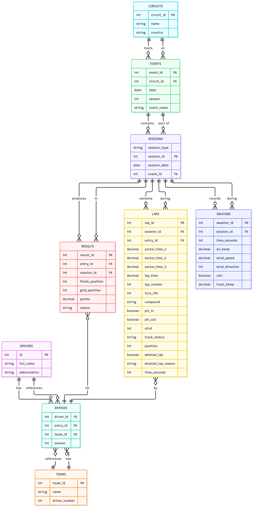

# Formula 1 Race Data Analysis Database

## Scope

### What is the purpose of the database?

The purpose of this database is to capture relationships that the FastF1 API doesn't model explicitly, such as which team a driver raced for in a given season (drivers do change teams between, and even within, seasons), and to streamline the filtering and joining otherwise required to answer a question like comparing tyre degradation across circuits.

### Which people, places, things, etc. are included in the scope of the database?

- **Sessions**: season, event, circuit, session type (race, qualifying, sprint, sprint qualifying)
- **Results**: driver, team, grid position, finishing position, points, status
- **Laps**: lap number, lap time, sector times, compound, tyre age, stint number, pit in/out, track status, position, deleted lap / deleted lap reason
- **Weather**: air temperature, track temperature, rainfall, wind speed, wind direction, sampled per session

### Which people, places, things, etc. are outside of the scope of the database?

- **Car telemetry** (speed, throttle, brake, GPS) — not needed for the target queries.
- **Race control messages** — the raw message log and its text content are out of scope; only the structured flags FastF1 derives from it (lap deletions and corrected stint data) are included.
- **Practice sessions** — too broad a data scope for this project.

## Functional Requirements

### What should a user be able to do with the database?

**SELECT**
- Tyre degradation: How does tyre age affect a driver's lap time, and does this differ between tyre compounds?
- Weather and degradation: How do track temperature and rainfall affect tyre degradation and compound choice across circuits?
- Strategy and finishing position: Which tyre strategies are associated with the best finishing positions at different circuits?
- Positions gained/lost: How many positions did each driver gain or lose during a race?
- Teammate comparison: How does a driver's race pace compare with their teammate when using the same tyre compound?
- Rain, wind, and strategy: How do rainfall and wind conditions during a session relate to the tyre strategies teams chose, and how did that affect finishing position?
- Sector time comparison: Which sector shows the largest time gap between tyre compounds, and does that gap grow as tyres age?

**INSERT**
- Add a new race session, including its circuit, session type, weather conditions, and participating drivers' results.

**UPDATE**
- Update a driver's race result when finishing position, points, or status changes after the fact (e.g., a post-race penalty).

**DELETE**
- Remove duplicate lap rows for a session that was accidentally loaded twice.

### What's beyond the scope of what a user should be able to do with the database?

- Analyze car telemetry such as speed, throttle, or braking, since that data isn't stored.
- Predict race outcomes or recommend strategies; the database supports the pace and degradation analysis a predictive model would use as input, but does not model or forecast anything itself.
- Query live or in-progress session data; all data is loaded after a session concludes.
- Delete or modify historical race results and lap data as a routine action. The one supported delete operation is narrowly scoped to correcting load errors, such as a session accidentally loaded twice, not pruning or editing the historical record.

## Representation

### Entities

* drivers: abbreviation is UNIQUE, but driver_number is not stored here. A driver's permanent number can change between seasons (Norris raced as #4 in 2025 and #1 in 2026), so a number fixed to the driver record would be wrong for one of those seasons. It belongs on entries instead, where it is tied to a specific season.
* entries: This table resolves a relationship FastF1 doesn't model directly: which team a driver raced for in a given season. It bridges drivers and teams, and results and laps reference it rather than storing driver_id/team_id directly. The constraint UNIQUE(driver_id, team_id, season) is three columns, not two, because of a real bug found while building load.sql: several drivers changed teams mid-season, so with only (driver_id, season) unique, each affected driver would have had two valid entries rows for one season. The results/laps load queries, which originally joined on driver and season alone, matched every row against both entries and loaded every result and lap twice for those drivers. Adding team_id to the join and the constraint fixed this, confirmed by checking that each driver-session now appears exactly once in results and laps.
* circuits / events / sessions: These are three separate tables rather than one, because a single table would repeat the same circuit and date once per session. One event (a race weekend) typically has two to four sessions (R, Q, and for sprint weekends, S and SQ), all at the same circuit, on effectively the same date. Splitting them out means that fact is stored once per event rather than once per session.
* results: UNIQUE(entry_id, session_id) ensures one entry has at most one result per session. None of finish_position, grid_position, points, or status has a NOT NULL constraint. Testing confirmed why: qualifying and sprint-qualifying sessions have no grid position, championship points, or classification status, since those concepts don't apply to a qualifying session, so those three are null for every Q/SQ row without a recorded classification (roughly 1,040 such rows across Q and SQ combined). Race and sprint sessions both have points correctly recorded (confirmed: 0 nulls across 788 race results and 230 sprint results). finish_position is usually still populated even in Q/SQ, since most drivers set a representative time, but is null for a small number of rows (9) where a driver was apparently unclassified in that session.
* laps: Several columns are nullable because different session types and race conditions legitimately produce missing values. lap_time is null on laps affected by a safety car. sector_time_1 is frequently missing on the first lap of a stint: checking HARD-compound laps at tyre_life = 1 found only 8 of 51 laps with a sector_time_1 value, versus 609 of 609 at tyre_life = 10, since there is no clean sector-1 timing reference right after a standing start or pit exit. position and tyre_life are null for qualifying/sprint-qualifying laps and for the rare case of a driver who did not start but still has a placeholder lap row. track_status is NOT NULL, since FastF1 always records some track-condition code once a session begins. compound's CHECK list includes 'UNKNOWN' and 'nan' alongside the five real tyre compounds, since both values appear in the raw data ('nan' from a pandas serialization quirk, 'UNKNOWN' from FastF1 itself) and needed to be accepted rather than rejected at load time.
* weather: Has no entry_id column, since weather is recorded per session, not per driver. rain is stored as INTEGER (0/1) rather than a finer-grained value, since FastF1 only reports whether rain was falling, not its intensity.
* stints (view, not table): Stint boundaries and compound can be derived entirely from laps.stint and laps.compound, so storing them separately would just duplicate data already in laps. The view recomputes them on demand instead.

### Relationships

The ER diagram shows the relationships between the entities in the database. A driver can have multiple entries across seasons, while each entry belongs to one driver and one team. An event belongs to one circuit and can contain multiple sessions. Each session can have multiple results, laps, and weather records. Each result and lap belongs to a specific entry and session. The stints view derives stint information from laps.

## Optimizations

Three UNIQUE constraints double as the database's indexes, since SQLite automatically creates an index backing every UNIQUE constraint:

entries(driver_id, team_id, season) enforces that a driver has at most one entry per team per season, and was added specifically after testing showed that a two-column constraint (driver, season) let a mid-season team change produce two valid entries, which in turn caused results and laps rows to be loaded twice for the affected drivers. The teammate-comparison query also relies on this combination, since it joins entries to itself on team_id and season.
results(entry_id, session_id) and laps(entry_id, session_id, lap_number) enforce that each entry has at most one result per session and at most one row per lap, and speed up every query that joins results or laps back to entries and sessions, which is most of the seven queries in queries.sql.

The stints view (see Entities) avoids storing derived data: stint boundaries and compound sequences are computed from laps on demand rather than kept as a separate, maintained table.

## Limitations

* Rain is binary, not continuous. weather.rain records whether rain was falling (0/1), not its intensity, so a light drizzle and a downpour are indistinguishable in this database.
* Stint sequences can overstate the number of tyre changes. FastF1's stint counter can increment without an actual tyre change, for example during a red flag. A sequence derived from stints may show more entries than the driver's real number of pit stops. Verified directly: one entry (session 1, entry 1) shows four consecutive INTERMEDIATE stints (stints 1-4) before changing to HARD, then back to INTERMEDIATE, six stint numbers for what was really only two genuine tyre changes.
* sector_time_1 is unreliable at the start of a stint. On the first lap of a stint (tyre_life = 1), sector 1 timing is frequently missing: for the HARD compound, only 8 of 51 qualifying laps at tyre_life = 1 have a sector_time_1 value, versus 609 of 609 at tyre_life = 10, since there is no clean timing reference after a standing start or pit exit. Query 7 excludes tyre_life = 1 for this reason.
* session_date reflects the event's date, not each session's own date. All sessions within one event weekend (R, Q, S, SQ) share the single date captured for the event, rather than each session's actual calendar date, since per-session dates were not captured during ingestion.
* No race control message content. Only the structured flags FastF1 derives from race control messages (lap deletions, corrected stint data) are stored; the messages themselves, driver penalties under investigation, safety car reasons, and similar, are not retained.
* No qualitative or strategic context. The database records what happened (positions, lap times, tyre choices) but not why; team radio, strategic reasoning, and incident details are out of scope.
